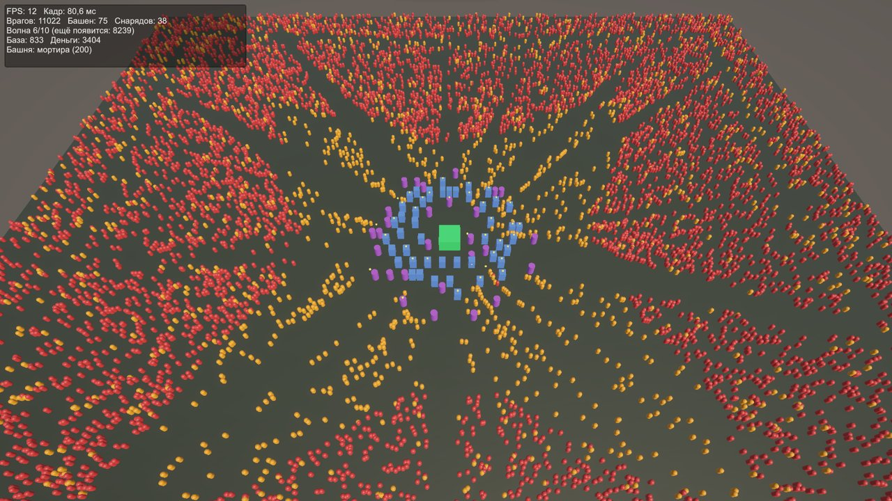
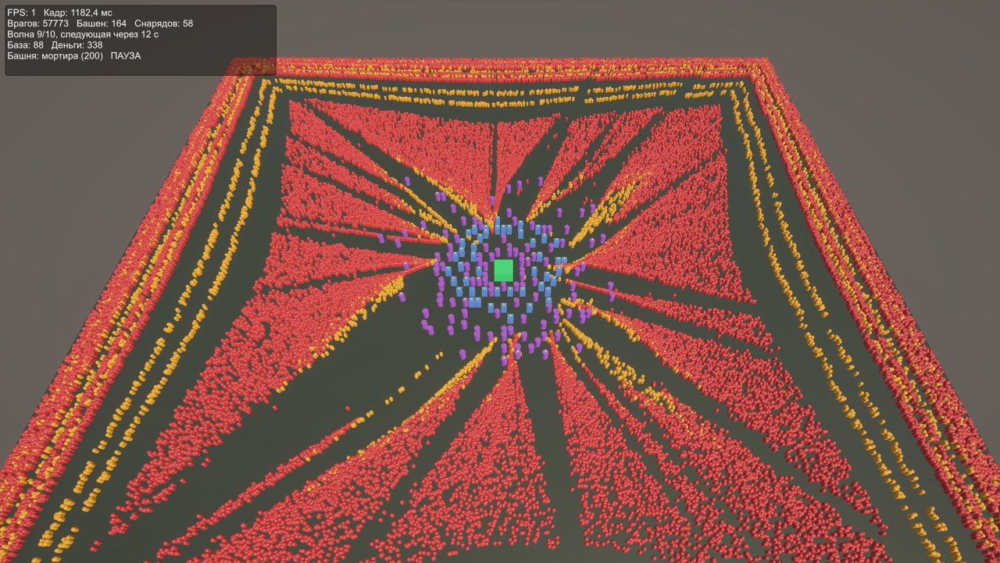
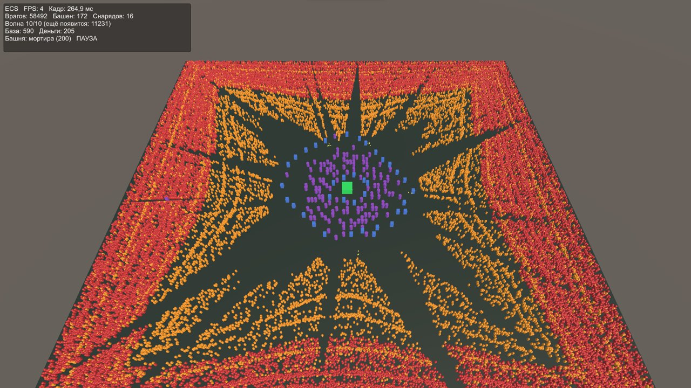
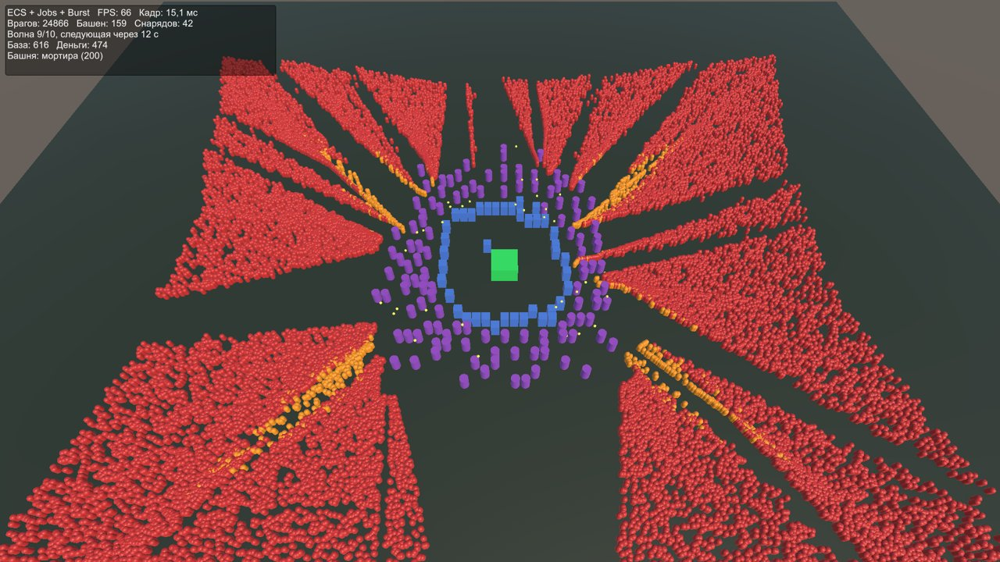
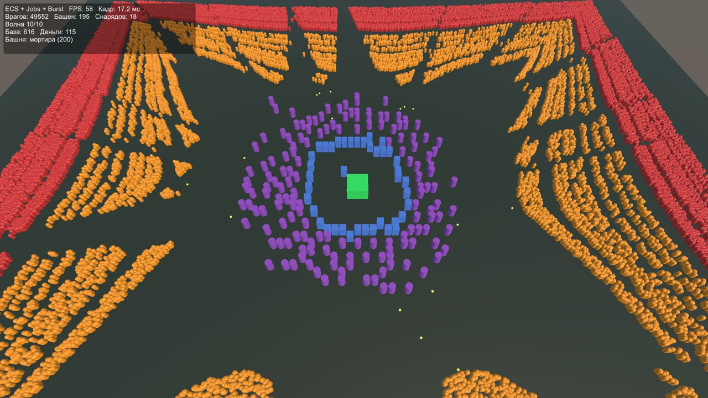
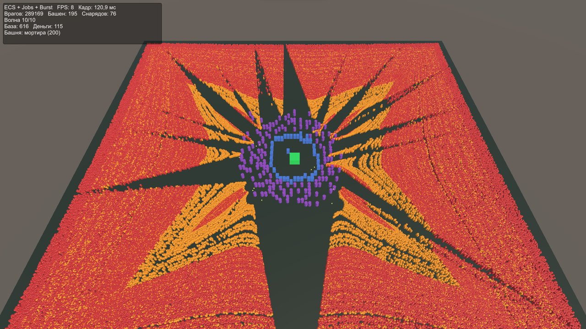

# Total Defense

Tower Defense с массовыми волнами врагов на Unity DOTS. Игрок обороняет базу от десяти волн, в последней из которых 50 000 врагов.

Проект сделан как учебный по оптимизации: одна и та же игра реализована тремя способами, чтобы сравнить производительность.

| Версия | Как устроена |
| --- | --- |
| MonoBehaviour | У каждого врага, башни и снаряда свой `Update()`; башня перебирает всех врагов |
| ECS | Те же объекты как сущности, пять систем в одном потоке, без Burst |
| ECS + Jobs + Burst | Параллельные джобы, пространственная сетка для поиска целей, Burst |

## Результат

На 50 000 врагов время кадра сократилось с 510–1 182 мс до 17,2 мс (58 FPS).

| Врагов, примерно | MonoBehaviour, мс | ECS, мс | ECS + Jobs + Burst, мс | Ускорение к MonoBehaviour |
| --- | --- | --- | --- | --- |
| 1 000 | 7,6 | 4,8 | 2,8 | 2,7× |
| 5 500 | 33,7 | 18,4 | 4,4 | 7,7× |
| 11 000 | 80,6–98,1 | 68,6 | 6,6 | 12–15× |
| 25 000 | 283,9–836,7 | 183,5 | 15,1 | 19–55× |
| 50 000 | 510,1–1 182,4 | 264,9 | 17,2 | 30–69× |

Версия на Jobs и Burst дополнительно проверена на 289 169 врагах: 120,9 мс, 8 FPS.

Оговорки к замерам:

- время кадра взято с экранной панели в живой игре, число башен в точках разное (от 15 до 195), поэтому ускорение приблизительное;
- для MonoBehaviour указан разброс по двум сериям замеров;
- в строке «50 000» MonoBehaviour и ECS измерены на 55 686–58 492 врагах, версия с Jobs — на 49 552.

## Скриншоты

MonoBehaviour, 11 022 врага — 12 FPS:



MonoBehaviour, 57 773 врага — 1 FPS:



ECS в одном потоке, 58 492 врага — 4 FPS:



ECS + Jobs + Burst, 24 866 врагов — 66 FPS:



ECS + Jobs + Burst, 49 552 врага — 58 FPS:



ECS + Jobs + Burst, 289 169 врагов — 8 FPS:



## Как запустить

Нужны Unity 6000.5.3f1 и пакеты Entities 6.5.0, Entities Graphics 6.5.0 и Input System.

1. Откройте проект в Unity.
2. Проверьте настройки:
   - Player Settings → Active Input Handling: Input System Package или Both;
   - в ассете URP Renderer параметр Rendering Path: Forward+ (нужен для Entities Graphics).
3. Откройте сцену нужной версии и нажмите Play.

Версия определяется компонентом на объекте в сцене:

| Версия | Компонент | Настройка |
| --- | --- | --- |
| MonoBehaviour | `GameManager` | — |
| ECS | `EcsGameManager` | галочка Use Jobs выключена |
| ECS + Jobs + Burst | `EcsGameManager` | галочка Use Jobs включена |

В поле Base Material должен быть назначен материал с шейдером Universal Render Pipeline/Lit и включённым GPU Instancing, иначе в сборке объекты будут розовыми.

Текущая версия написана в первой строке панели в левом верхнем углу.

## Управление

| Действие | Ввод |
| --- | --- |
| Движение камеры | WASD |
| Масштаб камеры | Колесо мыши |
| Выбор типа башни | 1 — пушка, 2 — мортира |
| Поставить башню | Левая кнопка мыши |
| Пауза | Пробел |
| Следующая волна сразу | N |
| Добавить 5 000 врагов для замера | T |

## Правила игры

- Карта 128×128 клеток, база в центре, у базы 1 000 единиц здоровья.
- 10 волн: от 1 000 до 50 000 врагов. Враги идут к базе по прямой и обходят башни.
- Пушка стоит 25 монет и бьёт по одной цели; мортира стоит 200 и бьёт по области.
- Стартовый капитал 500 монет, за каждую волну можно заработать фиксированную сумму.
- Поражение — здоровье базы упало до нуля; победа — отбита десятая волна.

## Как использован DOTS

**ECS.** Враг, башня и снаряд — сущности с компонентами `EnemyData`, `Health`, `TowerData`, `ProjectileData`. Состояние игры и поле пути хранятся в singleton-компонентах `GameState`, `GameConfig`, `FlowField`. Отрисовка идёт через Entities Graphics.

**Jobs.** Каждый кадр выполняется цепочка джоб:

| Джоба | Что делает | Тип |
| --- | --- | --- |
| `EnemyMoveJob` | Двигает врагов к базе | `IJobEntity`, параллельно |
| `BuildGridJob` | Раскладывает врагов по ячейкам сетки | `IJob` |
| `TowerShootJob` | Ищет ближайшего врага в соседних ячейках, создаёт снаряд | `IJobEntity`, параллельно |
| `ProjectileAimJob` | Обновляет позицию цели снаряда | `IJobEntity`, параллельно |
| `ProjectileMoveJob` | Двигает снаряды, собирает попадания | `IJobEntity`, параллельно |
| `ApplyHitsJob` | Наносит урон по цели и по области | `IJob` |

**Burst.** Все джобы и системы, кроме появления волн, скомпилированы Burst.

**Пространственная сетка.** Карта разбита на 32×32 ячейки по 4 м. Башня проверяет только врагов в ячейках своего радиуса, а не всех на карте.

## Структура скриптов

```
Assets/Scripts/Classic/
  GameManager.cs        сцена, волны, ввод, панель (MonoBehaviour-версия)
  Enemy.cs              враг
  Tower.cs              башня
  Projectile.cs         снаряд
  CameraController.cs   камера, общая для всех версий
  GridMap.cs            сетка карты и расчёт пути, общая для всех версий

Assets/Scripts/ECS/
  EcsGameManager.cs     сцена, сущности, ввод, панель (обе ECS-версии)
  EcsComponents.cs      компоненты
  EcsSystems.cs         появление волн и однопоточные системы
  EcsJobsSystems.cs     системы и джобы на Jobs и Burst
```

## Документы

- ГДД: ссылка
- Итоговый отчёт: ссылка
